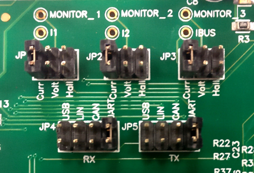
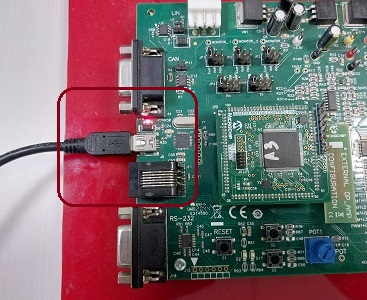

# Hardware Requirements and Set-Up Guide
This document provides information about the hardware requirements and set-up for running the Harmony Stream Analyze example project

## Hardware Requirements
## Setting up the hardware
- [dsPICDEM MCLV2 Development Board](https://www.microchip.com/DevelopmentTools/ProductDetails/DM330021-2)
- [ATSAME54 Plug-in module](https://www.microchip.com/DevelopmentTools/ProductDetails/PartNO/MA320207)
- [Hurst Motor](https://www.microchip.com/DevelopmentTools/ProductDetails/PartNo/AC300022)
- [24V Power Supply (AC002013)](https://www.microchipdirect.com/dev-tools/AC002013?allDevTools=true)/24V DC Power supply
- [MPLAB® ICD 4 In-Circuit Debugger (DV164045)](https://www.microchip.com/en-us/development-tool/dv164045)/ [MPLAB® PICkit™ 4](https://www.microchip.com/en-us/development-tool/PG164140)
- [Debugger Adapter Board (AC102015)](https://www.microchip.com/en-us/development-tool/ac102015) if ICD4 is used to program/debug ATSAME70/ ATSAME54
- Two mini USB cables
- Unbalance load set-up

## Set-Up Process:

### Setting up [dsPICDEM MCLV2 Development Board](https://www.microchip.com/DevelopmentTools/ProductDetails/DM330021-2)
Disconnect power to the dsPICDEM™ MCLV-2 Development Board and set up the hardware for testing ATSAME54 Motor Control PIM. The hardware setup procedure is described below:

1.	Set-up the jumpers as per the following table.

    | Jumpers | Conections |
    | --------------- | --------------- |
    | JP1 | Curr |
    | JP2 | Curr |
    | JP3 | Curr |
    | JP4 | USB |
    | JP5 | USB |
    | JP11 | Open |
    | J5 | Open |


    <p align="center">
        
        <figcaption align= "center"></figcaption>
    </p>

2.	Connect the motor phases to the output header J7. Connect the Green wire to “G‟. Connect white color wire to M1, red color wire to M2, and black color wire to M3.
    <p align="center">
        
        <figcaption align= "center"></figcaption>
    </p>

3.	Carefully insert the ATSAME54 PIM into U9 on dsPICDEM™ MCLV-2 Development Board. Verify pin orientation prior to installation.
    <p align="center">
        
        <figcaption align= "center"></figcaption>
    </p>

4.	Connect MPLAB® ICD 4 In-Circuit Debugger to J11 as shown in below figure. Connect debugger USB port to host computer.
    <p align="center">
        
        <figcaption align= "center"></figcaption>
    </p>

5.	Connect the Ext Op amp Configuration Board into J14. Ensure that the configuration board is correctly oriented before proceeding as shown in below figure.
    <p align="center">
        
        <figcaption align= "center"></figcaption>
    </p>

6.  Connect the USB communication port as shown below.
    <p align="center">
        
        <figcaption align= "center"></figcaption>
    </p>

7. Power the board with a 24V DC supply using J2 or BP1-BP2. For additional safety, it is recommended to use a current limited power supply while testing this software demonstration on a non-default hardware and motor.
    <p align="center">
        
        <figcaption align= "center"></figcaption>
    </p>

8. Connect the unbalanced load to the shaft of the motor as shown.
    <p align="center">
        
        <figcaption align= "center"></figcaption>
    </p>

    You can use the stl files from ```./config/docs/unbalanced_loads/``` to print your own unbalanced load.

