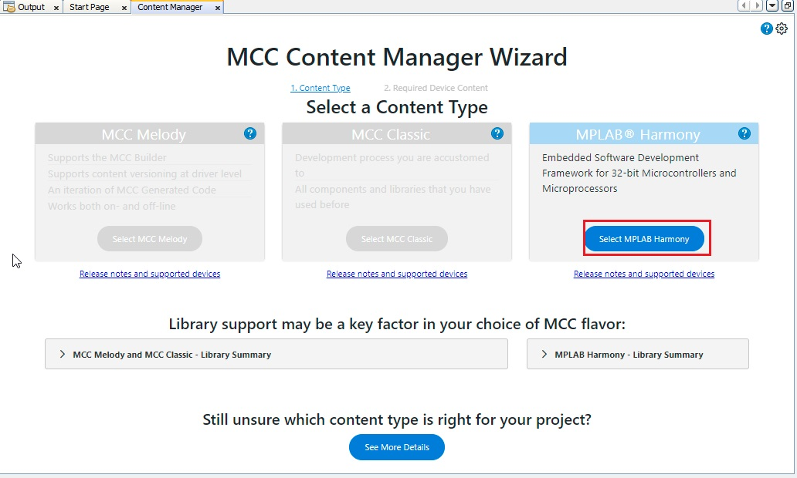
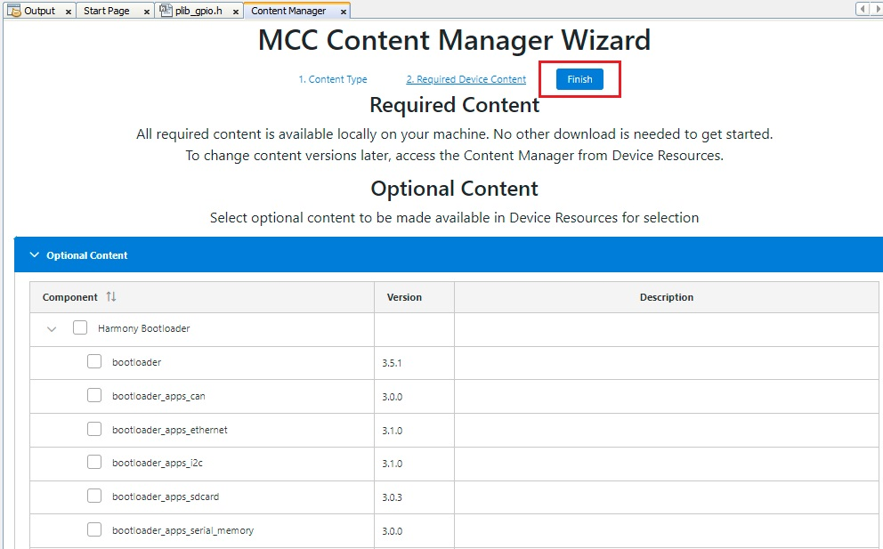

# Creating your first Harmony 3 Stream Analyze
Harmony Stream Analyze component leverages the power of Stream Anlayze Studio and Stream analyze engine to provide customers a comprehensive ecosystem to kick-start their AI/ML models in Microchip's 32 bit MCUs. 

This evaluation is subject to licensing terms and conditions of Stream Analyze. Please refer to detailed [license terms and conditions](../../Stream_Analyze_Terms_of_Use.pdf).

This document provides an step-wise method to create a your own AI/ML model.

## Table of Contents
- [Creating your first Harmony 3 Stream Analyze](#creating-your-first-harmony-3-stream-analyze)
  - [Table of Contents](#table-of-contents)
  - [Get Started](#get-started)
    - [Set-up the Hardware](#set-up-the-hardware)
    - [Install SA Engine and Visual Studio Code Plugin to interface SA Engine](#install-sa-engine-and-visual-studio-code-plugin-to-interface-sa-engine)
    - [Predictive Maintenance Project](#predictive-maintenance-project)
      - [Create Predictive Maintenance demo](#create-predictive-maintenance-demo)
        - [Create **ATSAME54P20A** based MPLAB Harmony 3 Project](#create-atsame54p20a-based-mplab-harmony-3-project)
        - [Create a Motor control project with QSpin](#create-a-motor-control-project-with-qspin)
        - [Add Framework for AI/ML model development](#add-framework-for-aiml-model-development)
        - [Generate the code](#generate-the-code)
    - [Run AI/ML model](#run-aiml-model)

## Get Started

### Set-up the Hardware
For detailed hardware requirements and set-up instructions, refer [Hardware Requirements and Set-Up Guide](./hardware_setup.md).
### Install SA Engine and Visual Studio Code Plugin to interface SA Engine
1. To install SA Engine, please follow [SA Engine installation guide](https://studio.streamanalyze.com/docs/manuals/sa-engine/installation/overview).
2. To install VSCode Plugin to interact with SA Engine, please follow [SA Engine VSCode Plugin installation guide](https://studio.streamanalyze.com/docs/manuals/sa-vscode/intro/).

<!-- ### Clone Harmony Stream Analyze component in your Harmony Framework path -->

### Predictive Maintenance Project
Load predictive maintenance project from the apps folder from following path ```./apps/predictive_maintenance_sam_e54/predictive_maintenance_sam_e54.X```
or
create a new project by following below steps.
#### Create Predictive Maintenance demo
Follow the following steps to create Predictive Maintenance demo using Harmony Stream Analyze component.
##### Create **ATSAME54P20A** based MPLAB Harmony 3 Project

1. Launch MPLAB® X IDE from the Microsoft Windows® Start menu. 
2. Go to the **File** option in the menu bar and select "**New project**"
3. In the Categories pane of the New Project dialog, select Microchip Embedded. In the Projects pane, select 32-bit MCC Harmony Project, then click Next.
4. In the Framework Path edit box, browse to the folder where you downloaded the framework. 
    <p align="center">
        
        <figcaption align= "center"></figcaption>
    </p>


5. In the Project Settings window, apply the following settings:
    - **Location**: Indicates the path to the root folder of the new project. All project files will be placed inside this folder. The project location can be any valid path, for example: "D:\Predictive Maintenance".
    - **Folder**: Indicates the name of the MPLABX .X folder. Enter "my_predictive_maintenance_project" to create a my_predictive_maintenance_project.X folder.

    - **Name**: Enter the project’s logical name as "my_predictive_maintenance_project". This is the name that will be shown from within MPLAB X IDE.

    - Click Next to proceed to Configuration Settings.

    <p align="center">
        
        <figcaption align= "center"></figcaption>
    </p>

6. Follow the steps below to set the project’s Configuration Settings.

    - **Name**: Enter the configuration name as "default".

    - **Target Device**: Select ATSAME54P20A as the target device.
        <p align="center">
            
            <figcaption align= "center"></figcaption>
        </p>

7. In MCC Content Manager Wizard window, click on "**Select MPLAB Harmony**"

    <p align="center">
        
        <figcaption align= "center"></figcaption>
    </p>

8. Select "motor_control" and "stream_analyze" repositories from **optional content** in MCC Content Manager Wizard window, and then click on "**Finish**"
    <p align="center">
            
            <figcaption align= "center"></figcaption>
    </p>


##### Create a Motor control project with QSpin
1. Go to plugins in the project graph, and launch **Qspin Motor Control Configuration** plugin
    <p align="center">
        
        <figcaption align= "center"></figcaption>
    </p>
2. Click "yes" for automatic activation of following components-
   - ADC0
   - ADC1
   - TCC0
   - BSP
3. Click "no" for automatic connection of following components-
   - X2CScope
    <p align="center">
        
        <figcaption align= "center"></figcaption>
    </p>

##### Add Framework for AI/ML model development
1. From the **Device Resources**, add **sa.engine** to the project graph.
    <p align="center">
        
        <figcaption align= "center"></figcaption>
    </p>
2. Connect RTC and SERCOM2
    <p align="center">
        
        <figcaption align= "center"></figcaption>
    </p>
3. Configure the SA Engine as shown:
    <p align="center">
        
        <figcaption align= "center"></figcaption>
    </p>


##### Generate the code
Click on the generate button to generate the code.

<p align="center">
    
    <figcaption align= "center"></figcaption>
</p>

### Run AI/ML model
1. Establish the physical connection
   Navigate to the ```src``` folder and execute the ```relay_process_start.cmd``` script to establish a physical connection between the edge device and SA Studio. Make sure that the USB port information is correctly updated in the ```connect.osql``` script as shown below.

   

2. Launch Visual Studio Code
3. Click on SA Engine icon from the activity bar as shown below.
      
4. Open the command line by ```ctrl + shift + p```, and connect the edge to local federation by command ```SA Engine: Connect to federation```
   
5. Create an interactive osql window by running ```SA Engine: Create ab interactive OSQL window``` as shown below.
   
6. Use the interactive window to interact with the edge device. [Here](sa_commands.md) are some queries you can use.


|OSQL Commands| Description|
|:--- |:---|:---|
| ```start_nameserver("ns")```| Start the Name Server - required when using with VSC|
| ```edge_cq("edge1","1+1")```| Simple 1+1, the hello world of edge computing |
| ```// plot: Line plot``` <br> ```edge_cq("edge1","sensor:stream([0])")``` | Stream signal 1 |
| ```// plot: Line plot``` <br>```edge_cq("edge1","sensor:stream([1])")``` | Stream signal 2 |


For more details on different supported mathematical functions for data analysis, refer [SA Engine tutorials](https://studio.streamanalyze.com/docs/guides/intro).

A simple statiscal model has been developed and placed at ```./apps/predictive_maintenance_sam_e54/src/models```. You use this model as a starting point for your predictive maintenance model development.